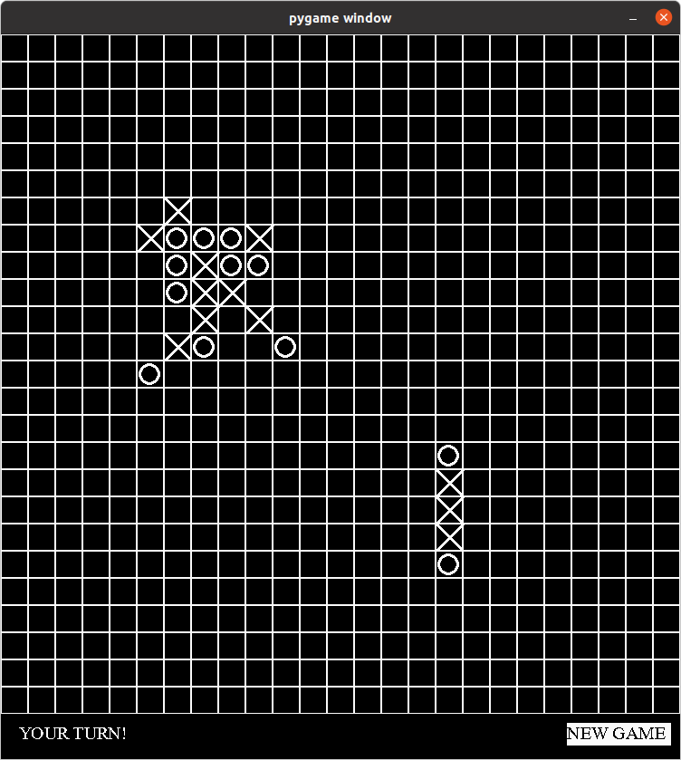
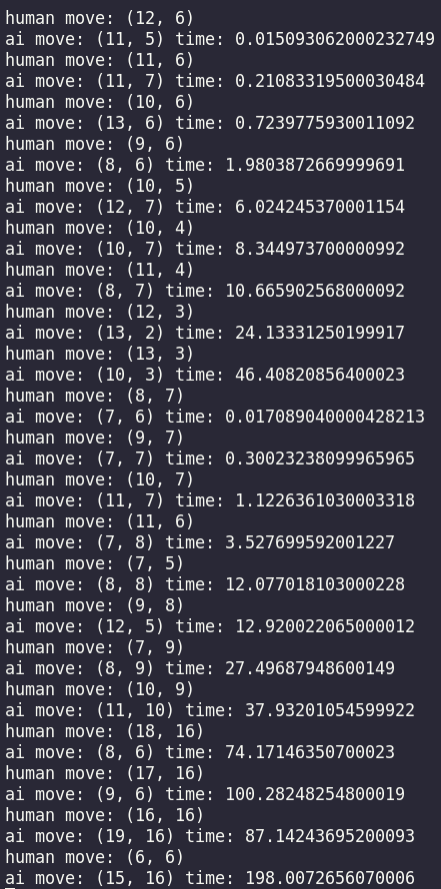

# Implementation document

This TicTacToe is a 25x25 TicTacToe application that uses the minimax algorithm and alpha-beta pruning to calculate the next move with an opponent (AI) and thus the player (human) can play against the computer.

## Implemented time and space complexities

Implemented time complexity is O(b^m) where b is the number of square's neighbors to search and m is the depth for the search.

As I have set the depth as 3 there time complexity is b^3. The algorithm is 'smarter' with depth of 4 but then the program is super slow, and therefore I chose to use depth of 3.

I have implemented Alpha-Beta pruning, and therefore the time complexity becomes O(b^m/2).

The space complexity is O(bm).

## Performance analysis

I am quite happy how fast the algorithm works in 25x25 game board. Of course it is a bit slow but considering the size of the game board, I believe I have achieved what I wanted from this course.

My tactic was to search only for the square neighbors (not the entire game board) because then there will always be less squares to search for. Also, now the algorithm is not inserting values to 'random' locations.

By looking at the pictures below, we can notice that the algorithm is quite fast in the beginning and starts to slow down when we go further in the game. Also, after we place a move far away from the other moves, the algorithm becomes slower. This is because it has to search for more squares (neighbors). If there had been more time, I could have specify even further which neighbors the algorithm chooses.
Gaming window/moves            |  Algorithm performance
:-------------------------:|:-------------------------:
 | 

## Flaws and improvements

Sometimes the algorithm is slightly 'stupid' and does not insert its move to the best location. Due to the time limitations I did not have time to make the algorithm more efficient.

For example, when the user clicks (0, 0), (0, 1), (0, 4), (0, 3), the algorithm does not recognize the user is winning meaning that it does not place its move to (0, 2). I noticed this mistake quite late in the process which is why I did not have time to fix it. Therefore, more evaluation should be done for the algorithm and this could be the next phase to make the algorithm better.

## Sources

##### Evaluation

[Geeks for Geeks - Minimax Algorithm in Game Theory | Set 2 (Introduction to Evaluation Function)](https://www.geeksforgeeks.org/minimax-algorithm-in-game-theory-set-2-evaluation-function/)

[Geeks for Geeks - Minimax Algorithm in Game Theory | Set 3 (Tic-Tac-Toe AI – Finding optimal move)](https://www.geeksforgeeks.org/minimax-algorithm-in-game-theory-set-3-tic-tac-toe-ai-finding-optimal-move/?ref=lbp)

##### Minimax algorithm and Alpha-beta Pruning

[Javapoint - Mini-Max Algorithm in Artificial Intelligence](https://www.javatpoint.com/mini-max-algorithm-in-ai)

[Javapoint - Alpha-Beta Pruning](https://www.javatpoint.com/ai-alpha-beta-pruning)

[Towards Data Science - Game Theory — The Minimax Algorithm Explained](https://towardsdatascience.com/how-a-chess-playing-computer-thinks-about-its-next-move-8f028bd0e7b1)

[Wikipedia - Alpha-beta pruning](https://en.wikipedia.org/wiki/Alpha%E2%80%93beta_pruning)

[Wikipedia - Minimax](https://en.wikipedia.org/wiki/Minimax)
