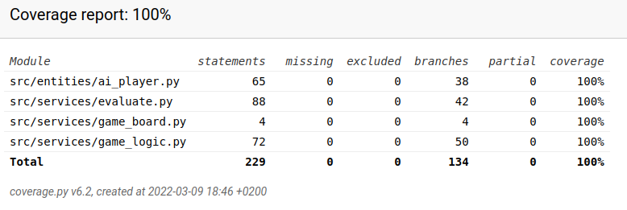

# Testing document

The program has been tested with automated unit tests and integration tests. Unittest has been used to create the tests. Besides automating tests, the system has been tested with manual tests.

## Unit and integration testing

#### TestAiPlayer class

`AiPlayer` class and `Evaluate` class have been tested with TestAiPlayer class. You can find the testing file [here](https://github.com/riikkayoki/TicTacToe/blob/master/src/tests/entities/ai_player_test.py).

* Tests the minimax algorithm.
* Tests that minimax find the best value for positioning the ai move.
* Tests whether each square is evaluated correctly.

#### TestGameBoard class

`GameBoard` class has been tested with `TestGameBoard` class. You can find the testing file [here](https://github.com/riikkayoki/TicTacToe/blob/master/src/tests/services/game_board_test.py)

* Tests the game board.

#### TestGameLogic class

`GameLogic` class has been tested with `TestGameLogic` class. You can find the testing file [here](https://github.com/riikkayoki/TicTacToe/blob/master/src/tests/services/game_logic_test.py)

* Tests if there is a free space in the game board.
* Tests if there is a win in the game.
* Tests if correct neighbors are found.
* Tests if there is a tie in the game.

### Test coverage

The coverage report shows 100 % for branch testing.

`GameMenuUi` class and `renderer.py` -file have been excluded from testing because they only run pygame events.

### System testing

The system testing of the application has been performed manually.

#### Installation and configuration

The application has been retrieved and tested in the Linux environment as described in the user guide.

#### Functionalities

All functionalities listed in the project specification document and user guide have been reviewed. The application has also been with different inputs.

